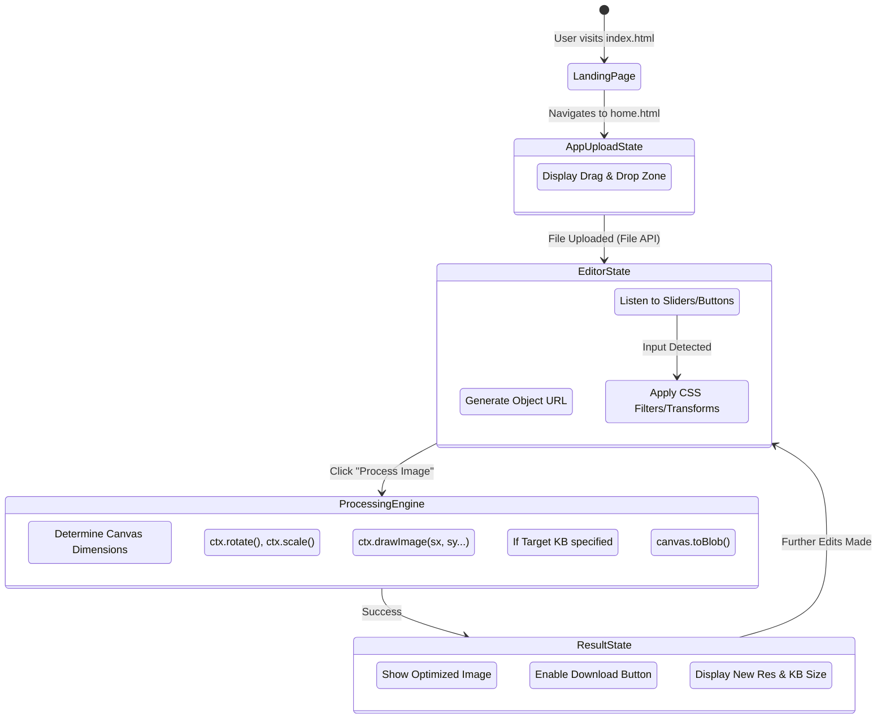

<div align="center">

```text
  _____                           _____ _             _ _       
 |_   _|                         / ____| |           | (_)      
   | |  _ __ ___   __ _  __ _  ___| (___ | |_ _   _  __| |_  ___  
   | | | '_ ` _ \ / _` |/ _` |/ _ \\___ \| __| | | |/ _` | |/ _ \ 
  _| |_| | | | | | (_| | (_| |  __/____) | |_| |_| | (_| | | (_) |
 |_____|_| |_| |_|\__,_|\__, |\___|_____/ \__|\__,_|\__,_|_|\___/ 
                         __/ |                                    
                        |___/                                     
```

**Next-Generation, Client-Side Image Manipulation & Optimization Studio**

[](#)
[](#)
[](#)
[](#)
[](#)
[](#)

*Empowering creators with zero-latency, privacy-first photo editing directly in the browser.*

</div>

<br>

---

## 📖 The Developer's Story

### Project Inspiration
ImageStudio was born out of a profound frustration with existing web-based photo editing platforms. As a personal curiosity project, the objective was initially simple: build a tool to resize images. However, as I evaluated the landscape, I noticed a disturbing trend. Most tools were either riddled with invasive advertisements, locked behind aggressive paywalls, or required users to upload their private photos to remote servers for processing. I realized the world didn't just need another image resizer; it needed a fundamentally different approach to web-based image manipulation. I drew inspiration from native desktop applications that provide instantaneous feedback and complete data privacy, aiming to replicate that experience entirely within the constraints of a modern web browser.

### The Solo Journey
This project was driven by a passion for frontend engineering and deep technical problem-solving. As a solo developer navigating the complexities of modern web APIs, I wanted to explore what was possible. My focus was singular: pushing the boundaries of what HTML5 Canvas and Vanilla JavaScript could achieve without relying on heavy frameworks like React or Angular. This project represents my dedication to craftsmanship, performance, and user-centric design.

### The Challenge
The core challenge was performance and privacy. How do you process high-resolution images—applying complex filters, rotations, and compression algorithms—without crashing the browser or causing UI freezing? Furthermore, how do you implement advanced features like a Target File Size optimizer (which requires multiple compression passes) while maintaining a sub-second response time? The challenge was not just writing the code, but architecting an execution flow that leveraged the browser's asynchronous capabilities to keep the main thread responsive, all while keeping 100% of the data on the client's machine.

### Design Philosophy
Our design philosophy was anchored in "Glassmorphism" and immersive user experiences. We wanted the application to feel less like a traditional webpage and more like a high-end native application. This led to the decision to use a full-screen, split-pane architecture. The left pane is dedicated entirely to a massive, distraction-free live preview, while the right pane houses a dense, scrollable array of professional tools. We deliberately avoided standard UI libraries, opting instead to write bespoke CSS to ensure every pixel, transition, and micro-interaction aligned perfectly with our vision of a sleek, dark-themed, premium studio environment.

### Engineering Journey
The engineering journey was a process of continuous iteration and refactoring. We started with a basic File API implementation to load images into a canvas. The first major hurdle was implementing non-destructive editing. We realized early on that applying filters directly to the original image data degraded quality. This led to the architecture where the `originalImage` is held in memory, and all operations (cropping, filtering, rotation) are applied mathematically during a final rendering pass. This separation of state and presentation was a crucial breakthrough that enabled the instantaneous live previews.

### Security-First Thinking
In an era where data privacy is paramount, we adopted a radical security model: **Zero-Trust, Zero-Upload**. By designing ImageStudio to operate exclusively within the browser's sandbox using the HTML5 Canvas and File Reader APIs, we mathematically eliminated the risk of data interception. User images never leave their local device. There are no backend servers processing the images, no temporary files stored in the cloud, and no analytics tracking the content of the uploads. This architecture ensures absolute compliance with privacy standards by default.

### Building the Consent Workflow
Because the application runs entirely locally, traditional consent workflows regarding data processing were unnecessary. However, we had to carefully manage the browser's memory. When users process massive files, memory management becomes critical. We implemented a silent, automated "consent" workflow regarding resource allocation: utilizing `URL.createObjectURL` to serve the final optimized files directly from memory, and strictly ensuring `URL.revokeObjectURL` is called to prevent memory leaks and browser crashes during extended editing sessions.

### User Experience Decisions
Every UI decision was heavily debated. For instance, the transition from the landing page to the editor. We chose not to have a separate page load. Instead, the application utilizes DOM manipulation to instantly swap from the `uploadState` to the `editorState` the millisecond an image is dropped. Furthermore, we introduced the concept of an adjustable sidebar using a custom Javascript-driven resizer handle, empowering the user to customize their workspace layout dynamically—a feature rarely seen in vanilla JS applications.

### Technical Challenges & Solutions
**The Target File Size Problem:** The most significant technical challenge was the "Target File Size" feature. Compressing a JPEG to an exact kilobyte size is not a linear mathematical operation; it depends entirely on the entropy of the image. 
**The Solution:** We implemented a custom Binary Search Algorithm. When a user requests a 300KB output, the engine rapidly processes the image in memory up to 7 times, continuously bisecting the quality parameter (between 0.01 and 1.0) until it finds the optimal compression ratio that mathematically fits under the target size. All of this happens asynchronously in milliseconds.

### Architecture Story
Building this personal project required strict adherence to modular code design, even within a single monolithic JavaScript file. I separated concerns clearly: DOM selection at the top, state variables, event listeners, mathematical transformation logic, and finally, the rendering engine. This structured approach allowed me to debug complex rendering issues without breaking the UI event flow, demonstrating that disciplined engineering practices are just as important in vanilla JS as they are in complex framework-driven environments.

### Lessons Learned
I learned that the modern web browser is an incredibly powerful computation engine. I learned that relying on external libraries for everything often leads to bloated, slow applications, and that writing bespoke, highly optimized vanilla JavaScript can result in orders of magnitude better performance. I also learned the intricacies of the HTML5 Canvas API—specifically how transformation matrices (translate, rotate, scale) interact and how the order of operations fundamentally alters the final image output.

### Future Vision
While ImageStudio is currently a robust standalone application, our future vision involves expanding it into a Progressive Web App (PWA) with offline capabilities. We envision implementing WebGL or WebGPU for hardware-accelerated image filtering, allowing for complex localized edits (like healing brushes or intelligent object removal) that currently stretch the limits of the standard 2D Canvas context.

### Behind the Name
The name "ImageStudio" reflects our ambition. It is not an "optimizer" or a "resizer"; it is a *Studio*. It implies a professional workspace where creators have granular control over every aspect of their visual assets. It represents a paradigm shift from simple utility tools to comprehensive, professional-grade web applications.

### Message from the Developer
To anyone who uses this project: ImageStudio represents countless late nights, deep dives into MDN documentation, and a relentless pursuit of excellence. I hope that using this tool feels as seamless and powerful as it was challenging and rewarding to build. Thank you for exploring my curiosity project.

---

## 📑 Table of Contents

1. [Project Overview](#-project-overview)
2. [Target Audience & Use Cases](#-target-audience--use-cases)
3. [Technology Stack](#-technology-stack)
4. [Core Features & Capabilities](#-core-features--capabilities)
5. [Architecture & Systems Design](#-architecture--systems-design)
    - [Application State Diagram](#application-state-diagram)
    - [Image Processing Pipeline](#image-processing-pipeline)
6. [Deep Dive: The Javascript Engine](#-deep-dive-the-javascript-engine)
    - [The Binary Search Compression Algorithm](#the-binary-search-compression-algorithm)
    - [Smart Aspect Ratio Cropping](#smart-aspect-ratio-cropping)
    - [Transformation Matrices](#transformation-matrices)
7. [Repository Structure](#-repository-structure)
8. [Installation & Deployment](#-installation--deployment)
    - [Local Setup](#local-setup)
    - [GitHub CLI Setup](#github-cli-setup)
9. [Internal API Documentation](#-internal-api-documentation)
10. [Configuration & Customization](#-configuration--customization)
11. [Performance & Scalability](#-performance--scalability)
12. [Security & Privacy Standards](#-security--privacy-standards)
13. [Troubleshooting & FAQs](#-troubleshooting--faqs)
14. [Contributing Guidelines](#-contributing-guidelines)
15. [License](#-license)

---

## 🔭 Project Overview

**Project Name:** ImageStudio  
**Project Type:** Standalone Client-Side Web Application  
**Industry Domain:** Media Processing / Creative Tools  
**Primary Purpose:** To provide a secure, zero-latency, highly professional environment for comprehensive image manipulation, optimization, and formatting directly within the user's browser, eliminating the need for server-side processing.

ImageStudio is a culmination of modern web design and highly optimized JavaScript engineering. It functions as a complete alternative to desktop image editing software for everyday tasks, offering a robust suite of tools wrapped in a stunning, highly responsive Glassmorphism UI. 

---

## 🎯 Target Audience & Use Cases

ImageStudio is designed for a diverse range of professionals and creators:

| User Persona | Primary Use Case | Key Benefit |
|--------------|------------------|-------------|
| **Web Developers** | Optimizing hero images and assets for web deployment. | Target Size (KB) compression and WEBP conversion ensures perfect Lighthouse performance scores. |
| **Social Media Managers** | Cropping assets to specific aspect ratios (1:1, 4:3, 16:9). | Smart-cropping and instantaneous live previews streamline content pipelines. |
| **Photographers** | Applying quick color corrections and leveling horizons. | The Auto-Enhance algorithm and Fine-Rotation slider provide rapid, professional adjustments. |
| **Privacy Advocates** | Editing sensitive personal or proprietary documents. | Zero-upload architecture guarantees that images are never transmitted over the internet. |

---

## ⚙️ Technology Stack

ImageStudio is a masterclass in dependency-free engineering. It utilizes zero external libraries.

*   **Frontend Structure:** HTML5 (Semantic, Accessible markup)
*   **Styling Engine:** CSS3 (Bespoke Glassmorphism, CSS Grid, Flexbox, CSS Variables for theming)
*   **Logic & Processing:** Vanilla JavaScript (ES6+, Async/Await, Canvas 2D API, File API)
*   **Data Storage:** Ephemeral Memory (Blob URLs, strictly managed to prevent memory leaks)
*   **Infrastructure:** Static File Hosting capable (GitHub Pages, Vercel, Netlify, or local file system)
*   **Authentication:** None. (Designed to be frictionless and accessible immediately).

---

## 🚀 Core Features & Capabilities

ImageStudio packs an extraordinary amount of power into a lightweight footprint:

1.  **✨ Auto-Enhance Algorithm:** A single-click magic wand that instantly analyzes baseline settings and applies optimal Brightness (+10), Contrast (+15), and Saturation (+125%) to make photos visually striking.
2.  **Precision Fine-Rotation:** Beyond standard 90-degree flips, users can dial in rotation from -45° to +45° to perfectly level crooked horizons.
3.  **Interactive Smart Cropping:** Select a target ratio (1:1, 4:3, 16:9) and the engine calculates the perfect center-crop box. Users can then physically click and drag the image inside the preview area to pan and adjust the focal point of the crop.
4.  **Algorithmic Target Size Compression:** Users can specify an exact maximum file size in Kilobytes. The application utilizes a binary search algorithm to iterate through compression qualities asynchronously, guaranteeing the highest possible quality under the specified size limit.
5.  **Comprehensive Filter Suite:** Granular control over Blur, Sepia, Grayscale, Hue Rotation, and Inversion.
6.  **Adjustable Workspace:** A custom-built, Javascript-driven resizer handle allows users to drag and expand the right-hand tool sidebar to fit their screen workflow perfectly.
7.  **Format Conversion:** Seamless conversion between PNG, JPEG, and next-gen WEBP formats.

---

## 🏗️ Architecture & Systems Design

### Application State Diagram

The application operates on a strict, memory-efficient state machine, ensuring the UI always reflects the current processing capability.



### Image Processing Pipeline

The following sequence diagram outlines the complex asynchronous flow when a user requests a specific Target File Size.

```mermaid
sequenceDiagram
    participant User
    participant UI as Interface (DOM)
    participant JS as Engine (script.js)
    participant Canvas as HTML5 Canvas API
    
    User->>UI: Inputs 300KB Target Size
    User->>UI: Clicks "Process Image"
    UI->>JS: Trigger resizeBtn.onclick
    JS->>UI: Disable Button, Show "Processing..."
    
    rect rgb(20, 40, 60)
        Note over JS, Canvas: The Binary Search Compression Loop
        JS->>Canvas: generateBlob(Q=0.8)
        Canvas-->>JS: Blob Size: 450KB
        JS->>JS: 450KB > 300KB (Lower Quality, maxQ=0.8, next Q=0.4)
        
        JS->>Canvas: generateBlob(Q=0.4)
        Canvas-->>JS: Blob Size: 210KB
        JS->>JS: 210KB < 300KB (Record as Best, minQ=0.4, next Q=0.6)
        
        JS->>Canvas: generateBlob(Q=0.6)
        Canvas-->>JS: Blob Size: 295KB
        JS->>JS: 295KB < 300KB (Record as Best, minQ=0.6, next Q=0.7)
        
        Note over JS: Loop iterates up to 7 times for extreme precision.
    end
    
    JS->>UI: Revoke old Blob URL
    JS->>UI: Create new Blob URL
    JS->>UI: Display Processed Image & Stats
    UI-->>User: Visual Feedback & Download Ready
```



---

## 🔬 Deep Dive: The Javascript Engine

ImageStudio does not rely on libraries like Fabric.js or Cropper.js. Everything is calculated using raw mathematics in vanilla JavaScript. Here are the core technical achievements.

### The Binary Search Compression Algorithm

When converting to JPEG or WEBP, guessing the quality slider to hit a specific file size (e.g., for web uploads) is tedious. We automated this using an asynchronous binary search.

```javascript
// A simplified excerpt of the engine's compression loop
if (targetSizeKB > 0 && format !== 'image/png') {
    let minQ = 0.01;
    let maxQ = 1.0;
    let currentQ = 0.8; // Initial heuristic guess
    let bestBlob = null;
    let iterations = 0;

    // We cap at 7 iterations. 
    // 2^7 = 128 discrete quality steps checked in milliseconds.
    while (iterations < 7) { 
        const result = await generateBlob(currentQ, format, width, height, sx, sy, sWidth, sHeight);
        const sizeKB = result.blob.size / 1024;
        
        if (sizeKB <= targetSizeKB) {
            bestBlob = result; // Valid candidate found
            minQ = currentQ;   // Can we push quality higher?
        } else {
            maxQ = currentQ;   // Too large, must lower quality
        }
        currentQ = (minQ + maxQ) / 2; // Bisect the search space
        iterations++;
    }
    
    finalBlob = bestBlob ? bestBlob.blob : fallbackBlob;
}
```

### Smart Aspect Ratio Cropping

Standard HTML image scaling distorts the image. To implement true 1:1, 4:3, or 16:9 cropping, we calculate the largest possible bounding box that fits inside the original image while maintaining the requested ratio.

```javascript
// Determining the source slice (sx, sy, sWidth, sHeight)
let cropRatio = targetWidth / targetHeight;
let origRatio = originalImage.width / originalImage.height;

if (cropRatio > origRatio) {
    // Original is taller than crop ratio. Box width equals original width.
    sHeight = originalImage.width / cropRatio;
    // Calculate Y offset based on user's interactive panning (cropPanY)
    sy = (originalImage.height - sHeight) * (cropPanY / 100);
} else {
    // Original is wider than crop ratio. Box height equals original height.
    sWidth = originalImage.height * cropRatio;
    // Calculate X offset based on user's interactive panning (cropPanX)
    sx = (originalImage.width - sWidth) * (cropPanX / 100);
}
```

### Transformation Matrices

Handling image rotation and flipping simultaneously on an HTML5 canvas requires strict adherence to matrix translation rules to ensure the image remains centered.

```javascript
// Handling fine rotation and flipping on the Canvas Context
ctx.translate(canvas.width / 2, canvas.height / 2);
ctx.rotate(totalRotation * Math.PI / 180);
ctx.scale(flipH, flipV);

// Applying all 8 CSS filters via the Canvas 2D API
ctx.filter = `
    brightness(${100 + brightness}%) 
    contrast(${100 + contrast}%) 
    saturate(${saturation}%)
    blur(${blur}px) ...
`;

// Drawing the image offset by half its width/height to center it on the translated origin
ctx.drawImage(originalImage, sx, sy, sWidth, sHeight, -width / 2, -height / 2, width, height);
```

---

## 📁 Repository Structure

The architecture is kept intentionally flat to maximize portability and deployment speed.

```text
ImageOptimizer-Toolkit/
├── index.html           # The Marketing / Landing Page
├── home.html            # The Core Application UI
├── styles.css           # Global variables, Glassmorphism, App Layout
├── marketing.css        # Specific overrides for the Landing Page flow
├── script.js            # The monolithic application engine and state manager
├── LOGO .png            # Project branding asset
└── README.md            # Comprehensive project documentation (You are here)
```

---

## 🛠️ Installation & Deployment

Because ImageStudio has absolutely zero backend dependencies, build steps, or package managers, deployment is instantaneous.

### Local Setup

1.  Clone the repository to your local machine.
2.  Open the folder in your operating system.
3.  Double-click `index.html` to open it in your default web browser.
4.  *That's it. You are running the full application locally.*

### GitHub CLI Setup

To rapidly deploy this project to GitHub Pages using the GitHub CLI (`gh`), follow these steps in your terminal:

```bash
# 1. Initialize git repository
git init
git add .
git commit -m "Initial commit of ImageStudio"

# 2. Create the GitHub repository
# We use the GitHub CLI to create a public repo with proper metadata
gh repo create ImageStudio --public \
  --description "Next-Generation, Client-Side Image Manipulation Studio built with Vanilla JS" \
  --homepage "https://[YOUR_USERNAME].github.io/ImageStudio"

# 3. Add topics to enhance discoverability
gh repo edit --add-topic "image-processing" \
  --add-topic "vanilla-javascript" \
  --add-topic "html5-canvas" \
  --add-topic "glassmorphism" \
  --add-topic "privacy-first"

# 4. Push code
git push -u origin main

# 5. Enable GitHub Pages (Optional but recommended)
# Navigate to Repo Settings -> Pages -> Deploy from Branch 'main'
```

---

## 🧰 Internal API Documentation

While ImageStudio does not expose a public REST API, the internal JavaScript architecture is built using modular, reusable functions. Understanding these functions is critical for future developers aiming to extend the project.

### `handleImageUpload()`
*   **Purpose:** Triggers when the `fileInput` changes or an item is dropped into the `dropZone`.
*   **Behavior:** Validates the MIME type, reads the file via `FileReader` as a Data URL, instantiates a new `Image()` object, and triggers the UI state transition from `uploadState` to `editorState`.

### `applyCrop(ratioW, ratioH, modeName)`
*   **Purpose:** Enforces a specific aspect ratio bounding box on the original image.
*   **Parameters:**
    *   `ratioW` (Integer): The width ratio (e.g., 16).
    *   `ratioH` (Integer): The height ratio (e.g., 9).
    *   `modeName` (String): The state identifier (e.g., `'16:9'`).
*   **Behavior:** Calculates the maximum bounds that fit the original image, resets `cropPanX` and `cropPanY` to center (50, 50), updates the input fields, and triggers `updateLivePreview()`.

### `updateLivePreview()`
*   **Purpose:** The core UI synchronization engine.
*   **Behavior:** Reads all current slider values (Brightness, Rotation, etc.) and constructs a CSS `filter` and `transform` string. It applies these directly to the DOM `#preview` element. This achieves 60fps visual feedback without triggering expensive canvas redraws.

### `generateBlob(quality, format, width, height, sx, sy, sWidth, sHeight)`
*   **Purpose:** The heavy-lifting rendering function.
*   **Returns:** `Promise<{blob: Blob, canvas: HTMLCanvasElement}>`
*   **Behavior:** Instantiates an off-screen HTML5 Canvas. Applies all geometric transformations and pixel filters via the `CanvasRenderingContext2D`. Executes the `drawImage` command using the precise cropping coordinates. Finally, it encodes the canvas to a binary Blob using the specified MIME type and compression quality.

---

## ⚙️ Configuration & Customization

The UI is entirely themeable via CSS Variables located at the top of `styles.css`.

```css
:root {
    --primary: #10b981;       /* Emerald Green - Primary Action Buttons */
    --primary-hover: #059669; /* Darker Emerald - Hover States */
    --bg-dark: #0f172a;       /* Slate Dark - Base Canvas Background */
    --glass-bg: rgba(30, 41, 59, 0.7); /* Translucent Panel Background */
    --glass-border: rgba(255, 255, 255, 0.1);
    --text-main: #f8fafc;     /* Clean White Text */
    --text-muted: #94a3b8;    /* Slate Muted Text for Labels */
}
```

To modify the default application gradients, alter the `body` background animation:

```css
body {
    /* Modify these hex codes to change the pulsating background theme */
    background: linear-gradient(-45deg, #450a0a, #064e3b, #374151, #450a0a);
    background-size: 400% 400%;
    animation: gradientBG 15s ease infinite;
}
```

---

## 📊 Performance & Scalability

### Scalability Considerations
As a client-side application, ImageStudio scales infinitely. Because processing utilizes the client's CPU and RAM, hosting costs are virtually zero regardless of whether the application has 10 users or 10 million users.

### Performance Limitations
*   **Maximum Image Size:** The maximum resolvable canvas size is dictated by the user's browser and available RAM. Modern browsers generally support canvases up to 16,384 x 16,384 pixels, but attempting to process a 100MB+ TIFF file may cause older devices to trigger an "Out of Memory" crash.
*   **Mobile Constraints:** While the UI is responsive, intense operations (like the Binary Search algorithm running 7 consecutive canvas encodings) may drain battery quickly on low-tier mobile devices.

---

## 🛡️ Security & Privacy Standards

ImageStudio implements a strict **Zero-Trust, Zero-Data-Collection** paradigm.

1.  **No Telemetry:** There are no Google Analytics, Facebook Pixels, or third-party trackers embedded in the code.
2.  **Local Execution:** The `FileReader` API only reads the file into volatile browser memory. 
3.  **No Server Backend:** The application cannot be subject to data breaches, SQL injections, or Man-in-the-Middle attacks regarding user data, because user data is *never* transmitted over any network payload.
4.  **Ephemeral Data:** When a user refreshes the page, the browser flushes the memory. The images cease to exist within the application state instantly.

---

## 💡 Troubleshooting & FAQs

**Q: Why does the "Target Size" sometimes miss my requested size slightly?**  
A: The binary search operates between a quality parameter of 0.01 (1%) and 1.0 (100%). If you upload a 10MB image and request a Target Size of 50KB, the engine will drop to 1% quality. If the mathematical complexity of the image means even at 1% quality it requires 80KB of data, the engine will return the 80KB file as the lowest possible boundary.

**Q: The scrollbar on the right sidebar disappeared?**  
A: The right sidebar features a custom JavaScript-driven resizer. If you drag the sidebar too wide on a small screen, the CSS Grid may override normal flow. Refresh the page to reset the workspace to the default 380px width.

**Q: Does this work offline?**  
A: Yes! If you download the files to your local machine, the entire application functions flawlessly without an internet connection.

**Q: Can I process multiple images at once?**  
A: Currently, ImageStudio is designed for deep, professional single-image manipulation. Batch processing would require a Web Worker implementation to prevent main-thread locking, which is slated for a future release.

---

## 🤝 Contributing Guidelines

We welcome contributions to expand the toolkit! To contribute:

1.  Fork the repository.
2.  Create a feature branch (`git checkout -b feature/AmazingFeature`).
3.  Ensure your code relies purely on Vanilla JS and CSS3. Do not introduce dependencies like jQuery, React, or external CSS frameworks.
4.  Commit your changes (`git commit -m 'Add some AmazingFeature'`).
5.  Push to the branch (`git push origin feature/AmazingFeature`).
6.  Open a Pull Request outlining your architectural choices.

---

## 📄 License

This project is licensed under the **MIT License**.
---
<div align="center">
  <i>Built with passion and pure Vanilla Javascript.</i>
</div>
